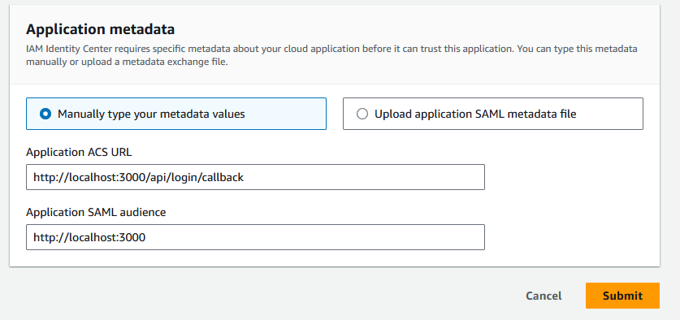
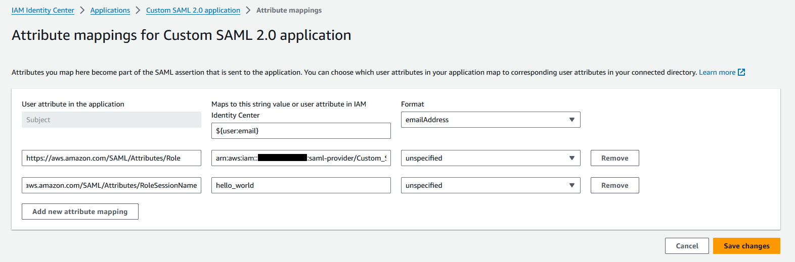

# next-app-samlify

A proof of concept for using AWS Identity Center SSO SAML with Next.js 

## Features
- SAML2 login with AWS Identity Center SSO
- Demo of AssumeRoleWithSAML to get temporary credentials for IAM Role

Many thanks to [tigaron](https://github.com/tigaron) who provided example using page router.
I've re-adapted his example with app router instead.

## AWS Identity Center SAML2 single logout
AWS Identity Center does not support SAML2 single logout in the service provider metadata. This means that if you logout from identity center, the session will remain on the webapp until it eventually expires.

i.e. `<md:SingleLogoutService>` gets ignored
```xml
<md:SingleLogoutService Binding="urn:oasis:names:tc:SAML:2.0:bindings:HTTP-Redirect" Location="http://localhost:3000/api/logout/callback"/>
```

## Getting Started

### Setup AWS SSO SP
- Generate valid X509 cert, I used self-signed with `openssl genrsa -out server.pem 2048`
- Generate SAML metadata, I used https://www.samltool.com/sp_metadata.php
- base64 encode XML set as SP_METADATA in .env

### Setup AWS SSO IDP
- Go to AWS Identity Center
- go to applications
- then create custom app
- choose acs url as `https://example-web-app.com/api/login/callback`
- download metadata.xml
- base64 encode XML, set as IDP_METADATA in .env

An example I used


### Setup IAM Identity Provider (Only for AssumeRoleWithSAML)
Go to IAM -> Identity Providers -> Create Identity Provider

Enter a useful name and upload idp metadata xml

Put the identity provider ARN in `.env` under `IDP_PROVIDER_ARN`

### Setup IAM Role with trust policy
Go to IAM -> Roles -> Create role

You can get the issuer from the `entityID` tag on the root EntityDescriptor node in the idP metadata XML

```json
{
    "Version": "2012-10-17",
    "Statement": [
        {
            "Effect": "Allow",
            "Principal": {
                "Federated": "arn:aws:iam::220207374598:saml-provider/Custom_SAML_2.0_application_ins-cbf2fb5ffb800e8e"
            },
            "Action": "sts:AssumeRoleWithSAML",
            "Condition": {
                "StringEquals": {
                    "saml:iss": ""
                }
            }
        }
    ]
}
```

Put the role ARN in `.env` under `IAM_ROLE_ARN`.

### Setup attribute mapping
An example mapping I used to get this working



The following attributes are optional unelss you want to use AssumeRoleWithSAML.

- Attribute 'https://aws.amazon.com/SAML/Attributes/Role' should have value of `{idp-provider-arn},{iam-role-arn}`
- Attribute 'https://aws.amazon.com/SAML/Attributes/RoleSessionName' should have meaningful value for lookup in cloudtrail for auditing

## Credits
- https://github.com/tigaron/nextjs-samlify
- https://blog.dan.drown.org/aws-cognito-error-message-invalid-base64-samlresponse/
- https://docs.aws.amazon.com/workspaces/latest/adminguide/setting-up-saml.html#create-assertions-saml-auth
